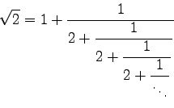
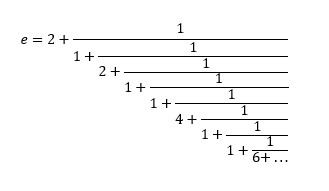

# Continued Fractions 
## Square root of 2
## Euler's number or natural number e

This java application implements the concept of continued fractions and has the following methods:
- calculate the value represented by an array of continued fraction elements
- calculate the square root of 2 using the given n elements of the continued fraction  
- calculate Euler's or natural number using the given n elements of the continued fraction 
- obtain the first n elements of the continued fraction representation for the square root of 2
- obtain the first n elements of the continued fraction representation for Euler's number

## The square root of 2 is represented by the following continued fraction:

## Euler's or natural number e is represented by the following continued fraction:

The continued fraction is stored as an array of integers.

### The value represented by the continued fraction array may be calculated either iteratively or recursively:
- the method `calculateValueRecursively()` calculates recursively
- the method `calculateValueIteratively()`calculated iteratively

### The square root of 2:
- the method `approximateSquareRootOf2(n)` approximates the value of the square root of 2 using the first `n` elements of 
the continued fraction array;
- the method `representSequenceRoot2(n)` represents the array of the first `n` elements of the continued fraction
		
### Euler's number of the natural number e:       
- the method `approximateE(n)` approximates the value of Euler's number using the first `n` elements of 
the continued fraction array;
- the method `representSequenceE(n)` represents the array of the first `n` elements of the continued fraction
